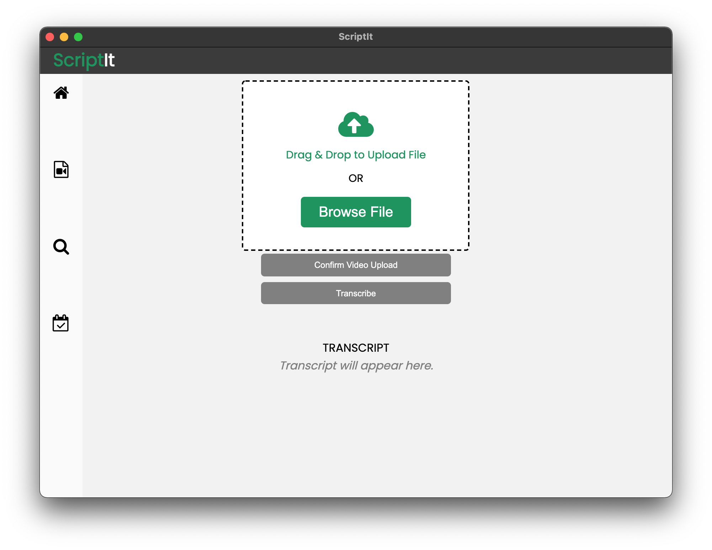

# ScripIt

ScriptIt is a Python application for transcribing video files. It is intended to be used for transcribing video lectures of courses, but it can be used for any other video as well. The production version will have functionality to search text within videos, and to extract dates from PDF documents to generate schedules. 

## Build

Open your terminal and follow the steps below to successfully run the application in your device.

1. Create a virtual environment:
    - On macOS and Linux:
  
        `python3 -m venv env`
        
    - On Windows:
        
        `py -m venv env`
        
2. Activate the virtual environment:
    - On macOS and Linux:
  
        `source env/bin/activate`
        
    - On Windows:
        
        `.\env\Scripts\activate`

3. Change directory to where the requirements.txt file is downloaded:
    - On macOS and Linux:
        
        `pip3 install -r requirements.txt`
        
    - On Windows:
        
        `pip install -r requirements.txt`
        
4. Change directory to where the `scriptit.py` file is stored:
    
    `python scriptit.py`
        
        
     
      

